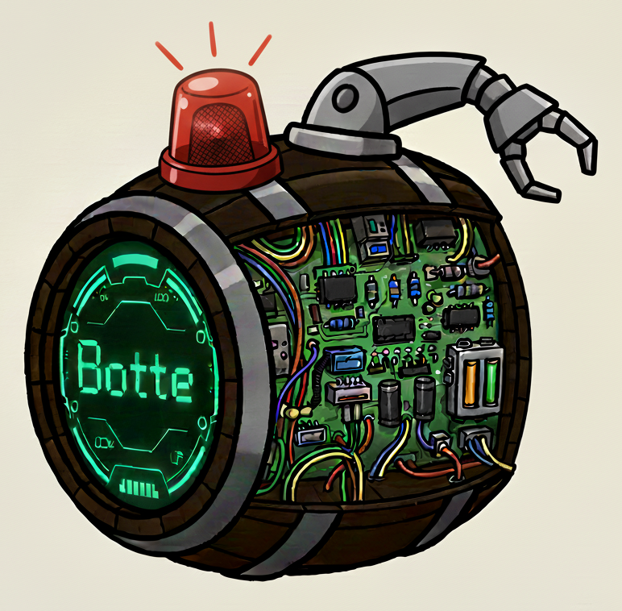

<p align="center">
  </a>
  <h1 align="center">
    Botte Backend
  </h1>
  <p align="center">
    Botte Backend. Botte is just a bot that sends messages to me, via Telegram for now.
  <p>
</p>

<br>

*Note on webhooks for Telegram user commands*
---------------------------------------------
The first version of this project is in [patatrack-monorepo](https://github.com/puntonim/patatrack-monorepo/tree/main/projects/botte),
 now archived. It included a webhook endpoint for Telegram user commands like `/echo`,
 to interact with the bot by sending messages.


📐 Architecture
================

See [README.md](../../README.md) in the root dir.


⚡ Usage
=====

See [README.md](../../README.md) in the root dir.


💬 Telegram configuration
=========================

See [README.md](../../README.md) in the root dir.


🛠️ Development setup
====================

1 - System requirements
----------------------

**Python 3.13**\
The target Python 3.13 as it is the latest Python runtime available in AWS Lambda.\
Install it with pyenv:
```sh
$ pyenv install -l  # List all available versions.
$ pyenv install 3.13.7
```

**Poetry**\
Pipenv is used to manage requirements (and virtual environments).\
Read more about Poetry [here](https://python-poetry.org/). \
Follow the [install instructions](https://python-poetry.org/docs/#osx--linux--bashonwindows-install-instructions).

**Pre-commit**\
Pre-commit is used to format the code with black before each git commit:
```sh
$ pip install --user pre-commit
# On macOS you can also:
$ brew install pre-commit
```

2 - Virtual environment and requirements
----------------------------------------

Create a virtual environment and install all deps with one Make command:
```sh
$ make poetry-create-env
# Or to recreate:
$ make poetry-destroy-and-recreate-env
# Then you can activate the virtual env with:
$ eval $(poetry env activate)
# And later deactivate the virtual env with:
$ deactivate
```

Without using Makefile the full process is:
```sh
# Activate the Python version for the current project:
$ pyenv local 3.13  # It creates `.python-version`, to be git-ignored.
$ pyenv which python
/Users/nimiq/.pyenv/versions/3.13.7/bin/python

# Now create a venv with poetry:
$ poetry env use ~/.pyenv/versions/3.13.7/bin/python
# Now you can open a shell and/or install:
$ eval $(poetry env activate)
# And finally, install all requirements:
$ poetry install
# And later deactivate the virtual env with:
$ deactivate
```

To add new requirements:
```sh
$ poetry add requests

# Dev or test only.
$ poetry add -G test pytest
$ poetry add -G dev ipdb

# With extra reqs:
$ poetry add -G dev "aws-lambda-powertools[aws-sdk]"
$ poetry add "requests[security,socks]"

# From Git:
$ poetry add git+https://github.com/aladagemre/django-notification

# From a Git subdir:
$ poetry add git+https://github.com/puntonim/utils-monorepo#subdirectory=log-utils
# and with extra reqs:
$ poetry add "git+https://github.com/puntonim/utils-monorepo#subdirectory=log-utils[rich-adapter,loguru-adapter]"
# and at a specific version:
$ poetry add git+https://github.com/puntonim/utils-monorepo@00a49cb64524df19bf55ab5c7c1aaf4c09e92360#subdirectory=log-utils
# and at a specific version, with extra reqs:
$ poetry add "git+https://github.com/puntonim/utils-monorepo@00a49cb64524df19bf55ab5c7c1aaf4c09e92360#subdirectory=log-utils[rich-adapter,loguru-adapter]"

# From a local dir:
$ poetry add ../utils-monorepo/log-utils/
$ poetry add "log-utils @ file:///Users/myuser/workspace/utils-monorepo/log-utils/"
# and with extra reqs:
$ poetry add "../utils-monorepo/log-utils/[rich-adapter,loguru-adapter]"
# and I was able to choose a Git version only with pip (not poetry):
$ pip install "git+file:///Users/myuser/workspace/utils-monorepo@00a49cb64524df19bf55ab5c7c1aaf4c09e92360#subdirectory=log-utils" 
```


3 - Pre-commit
--------------

```sh
$ pre-commit install
```

🔨 Test
======

To run unit and end-to-end tests:
```sh
$ make test
$ make test-e2e
```


🚀 Deployment
=============

### 1. Install deployment requirements

The deployment is managed by Serverless. Serverless requires NodeJS.\
Follow the [install instructions](https://github.com/nvm-sh/nvm#install--update-script) for NVM (Node Version Manager).\
Then:
```shell
$ nvm install --lts
$ node -v > .nvmrc
```
Follow the [install instructions](https://serverless.com/framework/docs/getting-started#install-as-a-standalone-binary)
for Serverless, something like `curl -o- -L https://slss.io/install | bash`.
We currently use version 3.12.0, if you have an older major version you can upgrade Serverless with: `sls upgrade --major`.

Then to install the Serverless plugins required:
```shell
#$ sls upgrade  # Only if you are sure it will not install a major version.
$ nvm install
$ nvm use
```

### 2. Deployments steps

#### 2a. AWS Parameter Store
Add to AWS Parameter Store these params:
 - `/botte-be/prod/telegram-token`  # The token required by Telegram to use the Telegram bot.
 - `/botte-be/prod/api-authorizer-token`  # The token required by some Lambda endpoints in this project.

#### 2b. Actual deploy
Note: AWS CLI and credentials should be already installed and configured.\

Finally, deploy to **PRODUCTION** in AWS with:
```sh
$ sls deploy
# $ make deploy  # Alternative.
```

To deploy a single function (only if it was already deployed):
```sh
$ sls deploy function -f endpoint-health
```


Deploy to a DEV STAGE
---------------------
Pick a stage name: if your name is Jane then the best format is: `dev-jane`.\
Create the keys in AWS Parameter Store with the right stage name.

To deploy your own **DEV STAGE** in AWS version:
```sh
# Deploy:
$ sls deploy --stage dev-jane
# Delete completely when you are done:
$ sls remove --stage dev-jane
```


©️ Copyright
=============

Copyright puntonim (https://github.com/puntonim). No License.
